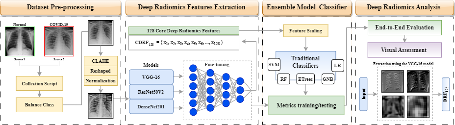

# CBMS-DL-based-radiomics

This repository contains the code used in **A Deep Learning-based Radiomics for COVID-19 Detection from CXR images using Ensemble Learning Model**

**Authors**: [Márcus V. L. Costa](https://github.com/usmarcv), [Erikson J. de Aguiar](https://github.com/eriksonJAguiar), [Lucas S. Rodrigues](https://github.com/lsrusp), [Jonathan S. Ramos](https://github.com/JonathanRamos), Caetano Traina Jr. and Agma J. M. Traina

**Conference**
> The 36th IEEE International Symposium on Computer-Based Medical Systems (IEEE CBMS2023) will be held at the University of L’Aquila, L’Aquila, Italy, from Thursday 22th to Saturday 24th of June 2023.

<!---
**Proposed Overview**

  

-->

