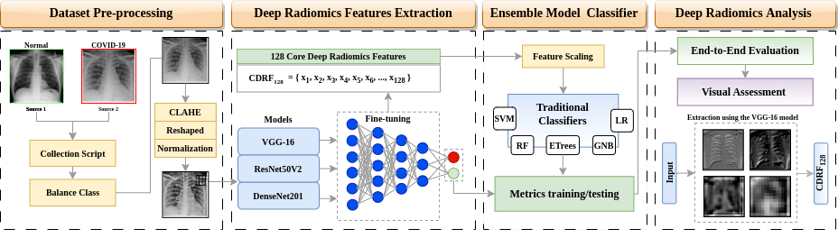
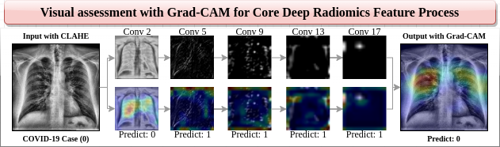

# CBMS-DL-based-radiomics

This repository contains the code used in **A Deep Learning-based Radiomics for COVID-19 Detection from CXR images using Ensemble Learning Model**

**Authors**: [Márcus V. L. Costa](https://github.com/usmarcv), [Erikson J. de Aguiar](https://github.com/eriksonJAguiar), [Lucas S. Rodrigues](https://github.com/lsrusp), [Jonathan S. Ramos](https://github.com/JonathanRamos), Caetano Traina Jr. and Agma J. M. Traina

**Summary**: [[`Paper`]()] [[`Dataset`](https://github.com/usmarcv/CBMS-DL-based-radiomics/tree/main/dataset_script)] [[`Results`](#results)] [[`BibTeX`](#citing-us)] [[`Contact`](#contact)]

**Conference**
> The 36th IEEE International Symposium on Computer-Based Medical Systems (IEEE CBMS2023) will be held at the University of L’Aquila, L’Aquila, Italy, from Thursday 22th to Saturday 24th of June 2023.

### Proposed Overview

<p align='center'>
  
<p>
<p align = "center">
<b>Fig.1: Workflow employed in this study.</b>
</p>


### Results
  
<p align='center'>
  
<p> 
<p align = "center">
<b>Fig.3: Visual assessment with Grad-CAM from a COVID-19 case, showing the behavior from Grad-CAM about one example extracted from each convolution process. Remark that COVID-19 case is labeled 0 and Normal (Healthy) is 1.</b>
</p>

### Citing us
```
@inproceedings{

}
```
  
### Contact
This work is part of my program Master's degree. You can contact me writing to [marcusvlc@usp.br](marcusvlc@usp.br) or [LinkedIn](https://www.linkedin.com/in/marcusvlc/).
  


